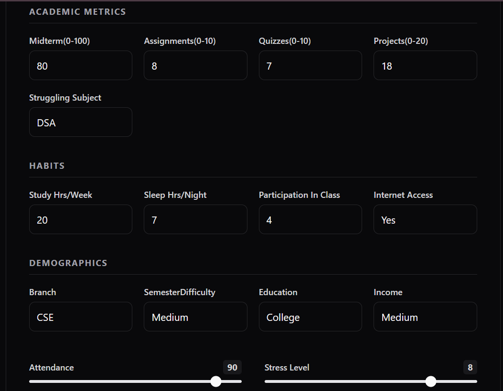
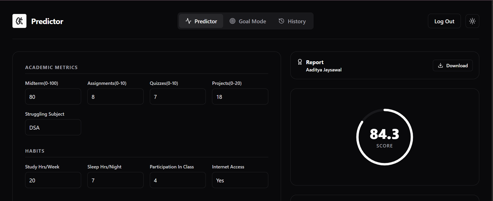
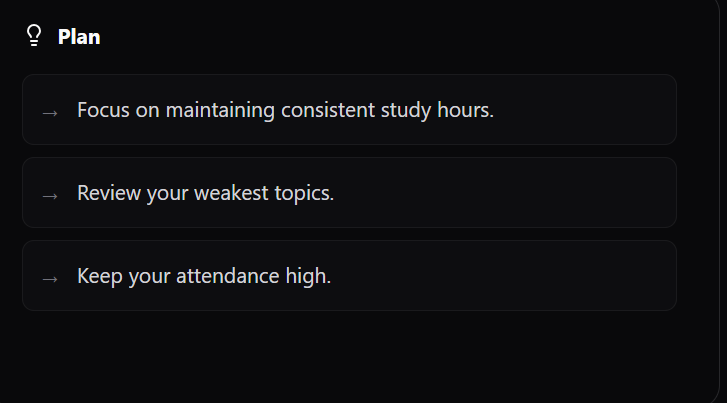

# 🎓 Student Performance Predictor
> An AI-powered Student Performance Prediction System built with React, FastAPI, XGBoost, and Groq AI that predicts student performance and generates personalized study recommendations.

## 📖 Overview

Student Performance Predictor is a full-stack Machine Learning application that predicts a student's final academic performance using academic, behavioral, and socioeconomic factors.

The application combines:

- XGBoost Machine Learning model
- FastAPI backend
- React + Vite frontend
- Groq Llama 3 AI for personalized study plans
- Interactive charts
- PDF report generation

The project demonstrates an end-to-end ML deployment workflow from prediction to AI-powered recommendations.

## ✨ Features

- Real-time student performance prediction
- Personalized AI study recommendations
- Interactive dashboard
- Downloadable PDF reports
- FastAPI REST API
- React + Tailwind UI
- XGBoost prediction model
- Firebase integration
- Performance visualization using Recharts

  ## 🏗 System Architecture

Student Input

↓

React Frontend (Vite)

↓

FastAPI Backend

↓

XGBoost Model

↓

Predicted Score

↓

Groq AI Study Plan

## 🛠 Tech Stack

| Category | Technology |
|----------|------------|
| Frontend | React 19 |
| Styling | Tailwind CSS |
| Backend | FastAPI |
| ML | XGBoost |
| Charts | Recharts |
| AI | Groq Llama 3 |
| PDF | jsPDF |
| Authentication | Firebase |

## 📊 Dataset

The model predicts student performance using:

- Midterm Score
- Assignment Average
- Quiz Average
- Project Score
- Attendance
- Study Hours
- Sleep Hours
- Stress Level
- Participation Score
- Branch
- Difficulty Level
- Parent Education
- Family Income
- Internet Access

  ## 🧠 Machine Learning Methodology

1. User enters student information.
2. FastAPI converts categorical inputs into numerical values.
3. Features are stored in a Pandas DataFrame.
4. The trained XGBoost model predicts the final score.
5. The student's information is sent to Groq AI.
6. Personalized study recommendations are returned.

## Why XGBoost?

XGBoost was selected because it performs exceptionally well on structured tabular datasets.

Compared with Linear Regression:

| Linear Regression | XGBoost |
|------------------|----------|
| Assumes linear relationships | Learns nonlinear patterns |
| Limited feature interactions | Captures complex interactions |
| More sensitive to outliers | More robust |
| Lower predictive accuracy | Higher predictive accuracy |

## 📂 Project Structure

Student-Performance-Predictor/

├── backend/

│ ├── main.py

│ ├── model.pkl

│ ├── requirements.txt

│ └── test_model.py

├── frontend/

│ ├── src/

│ ├── public/

│ ├── package.json

│ └── vite.config.js

└── README.md

## 🚀 Installation

### Clone Repository

git clone https://github.com/Aadi1Git/Student-Performance-Predictor.git

cd Student-Performance-Predictor

### Backend

cd backend

python -m venv venv

venv\Scripts\activate

pip install -r requirements.txt

### Frontend

cd frontend

npm install

npm run dev

## Environment Variables

Create a `.env` file inside the backend folder.

GROQ_API_KEY=your_api_key_here

## ▶ Running the Project

Start FastAPI

uvicorn main:app --reload

Start React

npm run dev

## API

### POST /predict

Returns:

- Predicted Score
- AI-generated Study Plan

## Screenshots

### Prediction Form

### Dashboard

### AI Study Plan

## Model Development

The XGBoost model was trained on student academic and behavioral features.

### Evaluation Metrics

| Metric | Value |
|--------|------:|
| MAE | 9.15 |
| RMSE | 17.26 |
| R² | 0.8985 |

### Actual vs Predicted

### Feature Importance

## Future Improvements

- SHAP Explainable AI
- Teacher dashboard
- Multi-semester prediction
- Docker deployment
- AWS deployment
- CI/CD with GitHub Actions

## 👨‍💻 Author

**Aaditya Jaysawal**

B.Tech Computer Science Engineering — KIIT University

GitHub: https://github.com/Aadi1Git
